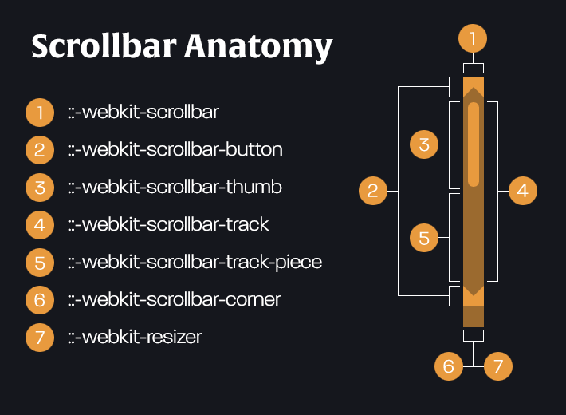

### LESSON-9

- RWD in SCSS
- AUTO DARK MODE / CUSTOM SCROLLBAR
- AOS library
- CAR RENTAL


### https://css-tricks.com/dark-modes-with-css/

```


@media (prefers-color-scheme: dark) {

}


```

```

body {
  background-color: black;
  color: white;
}
@media screen and (prefers-color-scheme: light) {
  body {
    background-color: white;
    color: black;
  }
}


````
### SCROLLBAR 

https://css-tricks.com/almanac/properties/s/scrollbar/

```

body::-webkit-scrollbar {
  width: 1em;
}
 
body::-webkit-scrollbar-track {
  box-shadow: inset 0 0 6px rgba(0, 0, 0, 0.3);
}
 
body::-webkit-scrollbar-thumb {
  background-color: darkgrey;
  outline: 1px solid slategrey;
}

````



