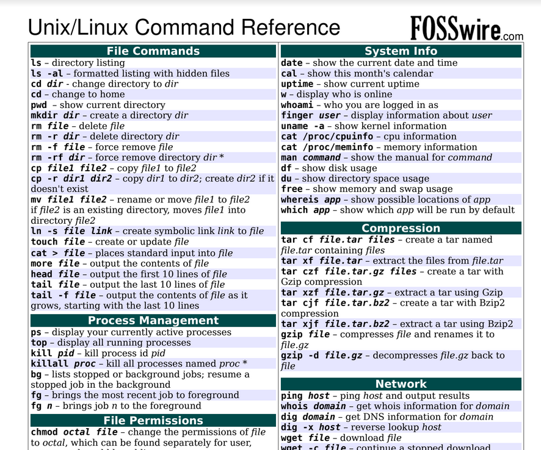

### Lesson-1

- OS terminals
1. CMD.exe
2. GitBash



```
cd folder_name ->  change folder 
cd .. -> go back
ls -> folder list
ls -a -> hidden folder or files show 

mkdir folder_name -> make folder
rm -rf folder_name ->

touch file_name.format -> creat file
rm file_name.format -> delete file

clear -> terminal clear 
cls -> on windows OS
```


