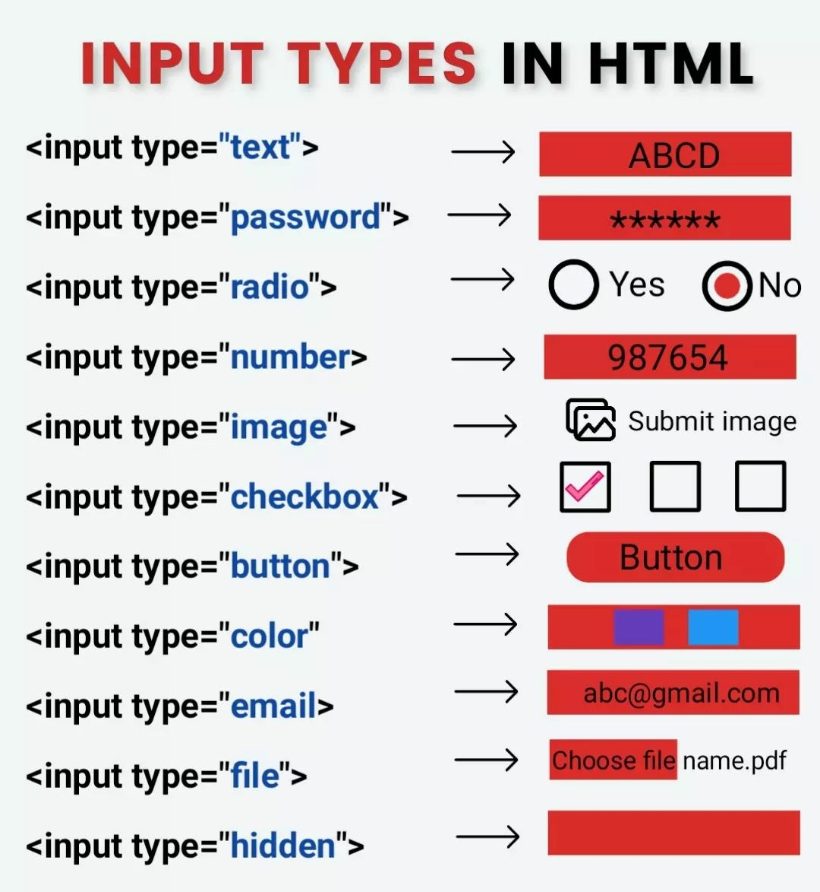

### LESSON-13


1. Takrorlash ->
2. HTML5 form elements
3. HTML5 media elements
4. Table
5. Image optimization
6. Transform 
7. Custom checkbox 


- Q.A
- form , input , select , lable , ....
- video , img , audio ,  iframe  ...
- png org jpg to webp 
- Transform
- Switch - > Custom checkbox 

<hr>

1.  text-properties +
2.  box-model -> +
3.  html tags +
4.  flex box -> +
5.  Units -> px , em , 1rem = 16px, % , vh , vw ; 
5.  Color: rgb -> red , green , blue -> +
6.  Position:   +
7.  Backgrounds: +
8.  Transition 
9.  Font families -> 
10. Pseudo classes -> 
11. Pseudo elements
```
.selector{
    property: value,
    property2: value2,

    . ...
    ...
    ....
}

```

Tag ? 
Selector ? [ class , id , tags , nested , ~ , > ]
Property ? 
Value ? 
Syntax ? 




