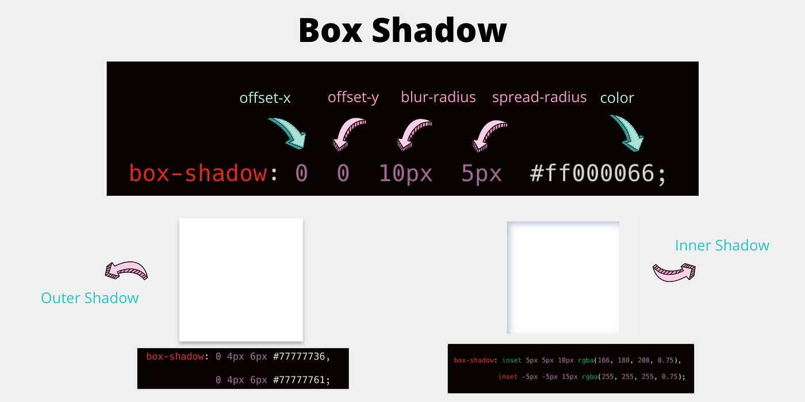
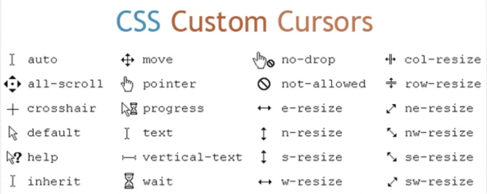

### LESSON - 9

1. Flexbox

 - ### flex container
 
 - justify-content
 - align-items
 - flex-direction
 - flex-wrap
 - align-content
 - column-gap
 - row-gap
 - gap

 

- ### flex-item

- order 
- grow
- shrink
- basis 

- pseudo-classes (0-1-0) - link, visited, active, focus
- pseudo-classes - hover
- Transition
    - property duration timing delay

- Box-shadow , text-shadow 

