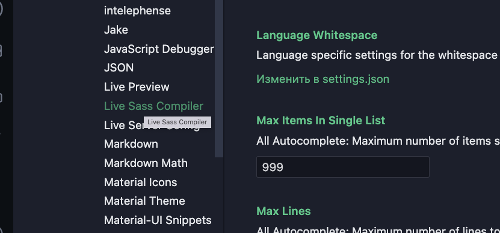

### LESSON-6

SASS / SCSS 

0. Minifire 
1. SCSS ? 
2. FOLDER STRUCTURE
3. Variables & NESTED SCSS
4. Psuedo class /  element
5. Extends 
6. Mixin
<hr>

<small>
 settings.json
</small>
1. step 


2. step


3. step



4. step


5. step


```
    "liveSassCompile.settings.formats": [
        {
            "format": "expanded",
            "extensionName": ".css",
            "savePath": "/css",
            "savePathReplacementPairs": null
        },
        {
            "format": "compressed",
            "extensionName": ".min.css",
            "savePath": "/css",
            "savePathReplacementPairs": null
        }
    ],


```
